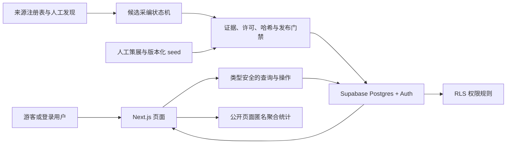
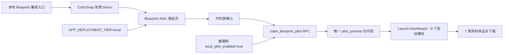
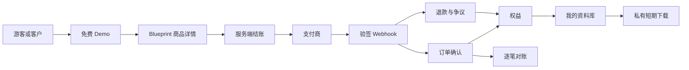

# 架构说明

当前代码是搜索优先的 AI Build Blocks Marketplace：`Capability` 是能力定义，`DemoPreview` 是免费预览，`CapabilityPackage` 是主商品，Bundle 和完整 App Blueprint 是组合/高级商品。首页、`/explore`、详情页和 Library 已迁移到 Build Block 主路径；旧 Demo 与仅限本地的 ColorSnap Blueprint #001 路由继续兼容。旧版本地试用访问权与未来订单、付款和客户权益严格分开。

## 模块职责

| 模块 | 职责 |
|---|---|
| `app/(public)` | 搜索优先的 Build Block 首页、目录、商品详情、免费 Demo Preview、Bundle/Blueprint 兼容入口和公开说明页面 |
| `app/(account)` | 登录后收藏页，以及本地 Blueprint Launch Dashboard、启动清单、时间线和资料样品 |
| `app/(account)/account/library/[slug]/download` | 仅本人可读的本地 Markdown 资料样品导出；不读取存储对象 |
| `app/(auth)` | `/login` 与 `/register` 页面 |
| `app/auth` | `/auth/registered` 注册成功结果、`/auth/check-email` 邮件提示、`/auth/confirm` 回调和退出流程 |
| `components/analytics` | 仅在成功渲染的首页、案例库和已发布详情页挂载匿名统计，并校验事件路径 |
| `components/blueprint` | 当前 ColorSnap 商品视觉、商品卡、Blueprint Score、Build Timeline、免费 Demo 入口和 Demo→Blueprint 转化组件；尚未拆出 Capability、DemoPreview 和 CapabilityPackage 组件 |
| `components/capabilities` | Launch Version 的高密度 Capability 卡片、可交互 Demo Preview、即时目录筛选、真实源码/Prompt 标签和 Package 状态 |
| `components/demo` | 使用真实产品预览的案例卡片、商业潜力编辑判断、逐区块主要主张和源码状态 |
| `components/demo/favorite-form.tsx` | 局部提交收藏/取消收藏并就地显示失败，不让单次请求错误击穿整页 |
| `components/media` | 只展示已批准图片/GIF/视频；支持海报、显式播放/停止、字幕、失败说明与重试 |
| `components/filters` | 把搜索与筛选条件同步到 URL |
| `lib/demos` | 参数校验、真实产品预览、主要主张与公开案例只读查询 |
| `lib/blueprints` | 校验 12 个公开决策区块与七类资料完整性，查询本地可见商品、本人的试用访问权和本人资料正文 |
| `lib/capabilities` | Capability 静态目录、AI 能力分类、双语搜索索引，以及只读取仓库真实 Package 文件的详情资料服务；不伪造购买权益 |
| `app/marketplace-system.css` | Galaxy / Uiverse 结构级重构的独立 Design Tokens、栅格、目录侧栏、卡片、详情工作台和响应式规则 |
| `reports/uiverse-audit` | 记录竞品结构审计、关键布局参数、对应实现与不可复制边界 |
| `lib/favorites` | 明确执行收藏或取消收藏，不做盲切换 |
| `lib/supabase` | 浏览器端、服务端、公开匿名查询和会话代理客户端 |
| `proxy.ts` | 在页面流式渲染前规范化查询，并对不存在的动态分类/工具返回真实 307 |
| `supabase/migrations` | 表结构、约束、索引、函数、触发器和 RLS |
| `supabase/migrations/20260717000100_*` | Blueprint 商品身份、Demo 关系和七类公开交付摘要；生产只创建结构，不写商品 |
| `supabase/migrations/20260717000200_*` | 本地试用开关、私有资料、试用访问权、幂等 RPC 和 owner-only RLS；默认关闭 |
| `supabase/migrations/20260718000100_*` | Blueprint Score 五维评分与 Build Timeline JSONB；只描述编辑估计和实施计划 |
| `supabase/migrations/*_content.sql` | 随 `db push` 进入生产的基础目录、ColorSnap 草稿和 12 条首发内容 |
| `supabase/seed.sql` | 10 个首发分类与 ColorSnap 私有草稿 |
| `supabase/seed_content.sql` | 12 个首发案例、来源、发布方、主张、证据、工具和素材关系 |
| `supabase/seed_blueprint_pilot.sql` | 仅供 Supabase Local reset 的 ColorSnap 商品、七类资料与开启本地试用标记 |
| `content/*.json` | 原创封面和真实产品预览的权属、来源、许可与 SHA-256 清单 |
| `packages/*` | 第001–025期已完成的自研 Capability Package：源码、Prompt、README、参数、Integration Guide、License 和 manifest；第019–025期新增引用来源、成果双栏、工具调用、代码差异、记忆控制、多模态附件和执行时间线，支付/下载未开放 |
| `scripts/validate-content-seed.mjs` | 在 PGlite 中执行 schema/生产内容 migrations，再重放两份 seed，验证镜像一致、发布门禁、媒体权属和幂等性 |
| `scripts/validate-db-contract-portable.mjs` | 在 PGlite 中运行除真实 `dblink` 并发外的 pgTAP 契约，提前暴露 SQL、RLS 和夹具错误 |
| `scripts/run-with-local-supabase.mjs` | 从 Supabase Local 状态只提取公开 URL/密钥与 Mailpit URL，移除服务端秘密后运行 E2E 或本地生产构建 |
| `scripts/release-preflight.mjs` | 发布前把干净完整 commit 与构建 ID、锁文件/迁移哈希、固定 CLI、seed 镜像和客户端密钥扫描绑定为一份证据 |
| `scripts/production-config.mjs` | 拒绝 localhost 与私网/保留 IP 字面量，校验无路径 HTTPS origin、公开密钥、Supabase Project Ref 和完整发布 commit |
| `scripts/verify-production-database.mjs` | 用生产公开密钥只读核对版本化 schema contract、12 个源码状态、132 条主要主张、12/10/4/8、ColorSnap 不可见和搜索 RPC |
| `supabase/tests` | pgTAP 数据权限、内容门禁、收藏隔离，以及 Blueprint 直接写拒绝、幂等授权、跨用户隔离和生产开关测试 |
| `tests/unit` | 环境、Blueprint 生产闸门、统计边界、公开状态、发布配置、分页、回跳、媒体加载和内容真实性测试 |
| `tests/e2e` | 游客浏览、Auth、收藏、Demo→Blueprint→模拟购买→本人资料库和三档响应式测试 |
| `tests/production`、`playwright.production.config.ts` | 只连接外部 HTTPS 站点，验证公开路由、SEO、404 和统计边界 |
| `DEPLOYMENT_RECORD_TEMPLATE.md` | 记录每次生产迁移、部署、验证和回滚证据 |
| Vercel Web Analytics | 仅记录公开页面的匿名聚合访问、访客和来源，不进入业务数据库 |
| `SOURCE_REGISTRY.md` | 记录 22 个发现渠道、允许的接入方式和自动化边界 |
| `EDITORIAL_GUIDE.md` | 定义候选状态、事实与假设、媒体权利和发布门槛 |
| `GOAL_COVERAGE.md` | 把原始完整目标逐项映射到 change 和终局完成证据 |
| `LAUNCH_CHECKLIST.md` | 记录 Launch Version 已完成的本地演示项、验证结果和公网阻断项 |
| `COMMERCE_SPEC.md` | 统一未来商品、价格、Blueprint、订单、权益、下载、支付、退款和咨询规则 |
| `MARKETPLACE_IA.md` | 定义 Capability、DemoPreview、CapabilityPackage、Bundle 和 App Blueprint 的目标页面树、搜索、详情结构、资产包和购买后资料库 |
| `ROADMAP.md` | 记录当前 MVP 之后各 change 的依赖顺序与阶段验收 |

## 当前调用关系

本地 Blueprint 试用链路：

应用闸门与数据库闸门必须同时开启。普通预览和生产环境返回 404 或空结果；试用访问权不进入订单、收入或客户权益统计。

## 目标交易调用关系

以下是后续真实交易 change 的目标合同，不是当前本地模拟获取能力：

| 目标模块 | 职责 | 当前状态 |
|---|---|---|
| `app/(public)/blueprints` | 本地 Blueprint 目录与 noindex 商品详情 | 已实现本地样品；生产关闭，尚不可索引或成交 |
| `app/(public)/checkout/[slug]` | 明确不扣款的本地获取确认 | 已实现本地试用；没有价格快照、订单或支付状态 |
| `app/(account)/account/library` | 本地试用访问权、七类资料正文和样品导出 | 已实现 owner-only 样品；不等于购买后权益或生产下载 |
| `lib/blueprints` | 本地商品、交付摘要、访问权和资料查询 | 已实现；只接受 `rework_required/pilot_preview/undecided` |
| `lib/commerce` | Offer、Price、订单和真实权益的服务端业务边界 | 未实现 |
| `app/api/payments/*/webhook` | 原始请求验签、幂等处理与订单/权益事务 | 未实现 |
| `app/api/downloads` | 权益检查和私有短期授权 | 未实现 |
| 商业数据库对象 | Blueprint 商品基础与本地试用授权已存在；不可变版本、Offer、Price、订单、支付、真实权益、下载、退款和对账 | 后半部分未实现 |

## 关键设计决定

- 首页、目录和详情采用“搜索 → AI 能力分类 → 高密度真实预览 → Preview/源码工作台”的工具型浏览骨架；布局比例与浏览节奏对齐 Galaxy / Uiverse，但不引入其组件、品牌、素材和社区数据，Capability 数据模型与 Package 真实性边界保持不变。

| 决定 | 原因 |
|---|---|
| 使用官方 `with-supabase` 示例 | 登录、Cookie 会话和 Next.js 版本路径有官方维护 |
| 不使用 ORM | 当前表少，Supabase 类型和 SQL 已足够，减少重复抽象 |
| 公开内容也存 Supabase | 内容、来源、评分、收藏可保持关系约束，后续扩到 100 条无需迁移内容系统 |
| 搜索先用参数化 `ILIKE` | 首批规模小且含中文，英文全文检索不合适 |
| 筛选写入 URL | 可刷新、分享、返回和被搜索引擎理解 |
| 动态分类和工具在代理层校验 | 无效值在流式页面开始前返回真实 307，避免软跳转和 200 假成功 |
| 公开详情使用已发布 slug 静态参数 | 未发布或未知案例返回真实 404/noindex，不让草稿路径变成软 404 |
| 详情正文以主要主张为单一来源 | 11 个区块各有唯一主要主张；事实、推断、假设标签不会与另一份正文悄悄漂移 |
| 源码状态独立建模 | 案例形态或成熟度不能代替源码证据；开源状态必须由非镜像规范仓库和同 URL 开源证据共同证明，未知状态不能发布 |
| 商业潜力必须带规则版本和理由 | 防止把主观判断包装成客观事实；完整五维评分后置 |
| 素材必须有授权状态 | 未确认授权的截图不能进入公开页面或付费包 |
| 权属清单、seed 与数据库逐项校验 | 避免许可文本、来源、哈希或海报在三处悄悄漂移 |
| 首发关系采用指纹驱动的收敛式 seed | 声明变化时移除旧关系后重建；指纹未变化时完全跳过关系写入，使 UUID、`created_at` 与公开状态严格幂等 |
| 首发内容也进入版本化数据 migration | 生产 `db push` 不执行 seed；migration 才能保证首次生产发布不是空库，测试强制其与本地 seed 一致 |
| 案例保存内容指纹 | 内容未变化时重复 seed 不更新 `updated_at`，避免 sitemap 把全部案例误报为刚更新 |
| 收藏不更新案例内容时间 | 收藏计数是互动状态，不是内容编辑；sitemap 的 `updated_at` 只跟随案例内容字段变化 |
| 本地静态媒体走 Next 图片优化 | 保留原始获准文件与哈希，同时按视口输出较小格式，避免移动端下载全部原图 |
| 大 GIF 海报优先 | AnythingLLM 动画体积较大；不改动获准原文件，用户主动播放前只请求已登记静态海报 |
| 详情媒体完整展示并保留文字摘要 | `contain` 避免截图裁切；GIF 可停止，视频有字幕时必须输出字幕轨，加载失败仍保留内容意义 |
| 分析组件按成功页面挂载 | 404、草稿、账号、收藏和隐私页面不加载统计；事件路径必须等于当前公开页面 |
| 收藏错误局部呈现 | 网络或数据库失败只影响当前按钮，用户可重试，不能把整张卡片或详情页伪装成错误页 |
| 生产环境失败即停 | 生产 origin 必须是无路径的 HTTPS，并拒绝 localhost 与私网/保留 IP 字面量；同时只接受 Supabase 公开密钥，发布前还需干净提交、迁移镜像与客户端密钥扫描 |
| 生产库返回版本化目录合同 | 本地 migration 哈希不能证明远端已升级；只读验收还要直接核对新字段、12 个源码状态和 132 条主要主张 |
| 发布依赖写入先锁父案例 | 延迟约束在并发事务中也必须看到前一事务的提交结果，不能让两个编辑分别删掉最后两份依赖 |
| 不做自动抓取 | 先验证内容价值，并避免条款、版权和脏数据风险 |
| 创业改造使用四个固定字段 | 用户、内容、场景和新机会能被比较、筛选和后续复用，不埋在长文里 |
| 来源平台与发布方分开 | GitHub/Gitee 等只说明在哪里发现，不能替代法律主体和地区证据 |
| 多主体按角色记录 | 开发方、服务运营方和合同主体可位于不同地区，不强行压成单一公司 |
| 案例形态独立 | 产品、官方模板、平台工作流和内嵌功能不能混写成同一种正式 SaaS |
| 候选状态不可跳级 | 自动或人工发现都只能进入候选，事实、编辑判断和素材逐层通过后才发布 |
| 抽象封面不能替代产品展示 | 每个公开案例必须有一份获准使用的真实截图/GIF/视频，否则“截图优先”无法验收 |
| 卡片也使用真实产品预览 | 首屏发现阶段就展示产品本身；缺少合格媒体时查询失败，不退回抽象占位图 |
| 发布证据绑定完整 commit | 构建前后必须是同一干净 commit，并记录构建 ID、依赖锁与迁移哈希；部署 CLI 固定版本且写入同一 commit metadata |
| 免费目录长期公开 | 会员出售深度分析、可售 Blueprint 和更新，不把用于 SEO 的基础案例库改成付费墙 |
| 先验证一个再复制到二十个 | Blueprint #001 先跑通生产购买、授权、下载和退款，成立后再制作 #002–#020 |
| Capability Package 是主商品，DemoPreview 是免费预览 | 防止免费预览和第三方源码被误写成本站可售资产；Capability、Package、Bundle 与 App Blueprint 使用显式关系连接 |
| 本地试用访问权独立于商业权益 | 可验证商品获取路径，但不能污染未来订单、收入、退款或已购判断 |
| Blueprint 使用应用与数据库双闸门 | 路由关闭不足以阻止直接 RPC；数据库默认关闭并且生产不执行本地 seed |
| 七类资料正文 owner-only | 商品页只展示交付摘要；本人获得试用访问权后才由 RLS 返回资料正文 |
| 首阶段为本站自营精选商店 | 多卖家需要合同、KYC、分账、提现、税务和争议系统，不能混入第一笔交易 |
| 商城发布晚于真实成交闭环 | 页面存在不等于可交易；至少一个生产购买、权益、私有下载、退款和对账通过后才公开声明可成交 |
| 免费内容增长与交易并行 | 100 个 Demo 能证明内容产能，不能替代一个 Blueprint 的真实购买与交付 |

## 数据边界

- 公开用户只能读取 `published` 案例。
- 内容写入只允许受控数据库迁移；Web 运行时不持有 Service Role Key。
- 用户只能读取、添加和删除自己的收藏。
- 密钥不进入客户端包、日志或仓库。
- ColorSnap 的 `.chrome-profile` 永远不复制到项目目录。
- 登录、确认和个人收藏页不发送分析事件；公开 URL 不包含邮箱、用户 ID 或令牌。
- 任何来源接入只写候选表；数据库发布约束不能被 API、脚本或人工 SQL 绕过。
- 当前 migration 已创建 Blueprint 商品基础、七类资料和 `pilot_preview` 访问权；生产默认关闭且没有 seed 商品。数据库仍没有订单、支付、会员、客户权益、下载、退款或收入记录。
- `pilot_preview` 只服务本地评审，不能被未来商业代码解释为已购、付款、会员或永久许可。
- 后续客户端不能直接写订单、支付、退款、订阅、权益或支付事件；支付成功页也不能授予权限。
- 未来真实 Blueprint 包使用私有存储且没有直接读取策略；当前本地试用只把 RLS 保护的七类资料正文导出为 Markdown 样品，不签发生产下载授权。
- 财务和条款记录不能随 Auth 用户级联删除；退款只能撤销未来访问，不能声称删除用户设备中的文件。
